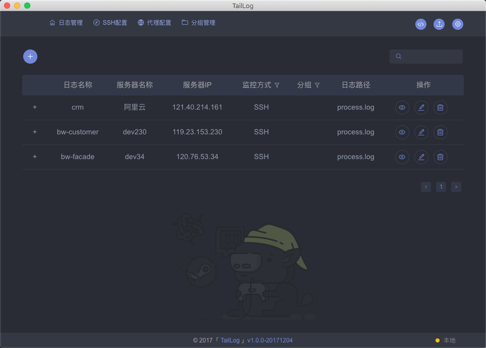
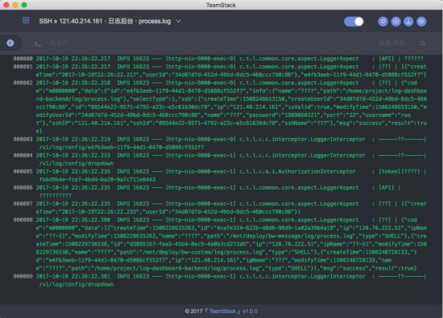
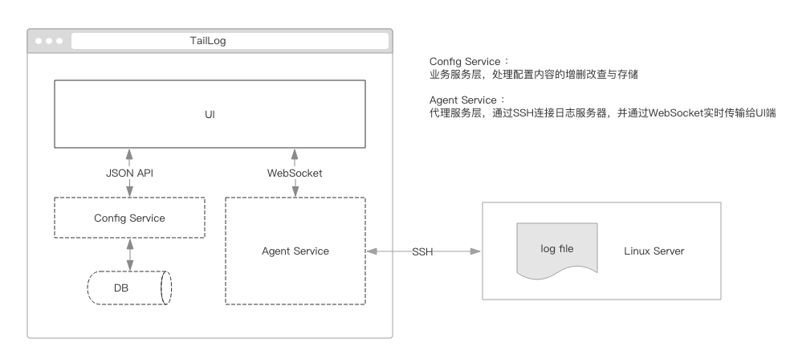

# 简介

[TailLog](http://taillog.cn/) 是一款实时日志查看监控工具。

通过一次配置，即可便捷查看和监控本地或远程的日志信息（类似命令"tail"，实时展示并跟踪日志信息）。

同时提供搜索，高亮等辅助等功能，方便快速定位异常，让你更专注于程序开发与维护。

更多信息请查看[介绍](https://github.com/djmpink/TailLog)

# 工程结构与原理

# 源码部署与运行
## 环境
如果你是一位专业的前端开发工程师，我想你已经具备了常用且必要的开发环境，可以直接跳过该部分，了解开发调试相关内容即可。
如果十分不幸遇到环境问题，可以尝试在这里找到答案。

* 主要会涉及的工具与环境：
    * Node.js
    * python2
    * electron
    
* 在开发或部署过程中，有一些注意事项或建议，可以更好的使用本工程：
    * npm加速 [可选，推荐]
    
        `npm config set registry=https://registry.npm.taobao.org`
       
    * Windows环境
    
        因为win上没有C相关编译环境，而该工程需要安装Node-sass，该模块需要编译环境（linux系环境可忽略）
        
        `npm config set sass-binary-site=http://npm.taobao.org/mirrors/node-sass`
   
   * Mac环境
        
        如果需要在Mac系统编译打包Windows系统的应用程序，则需要安装wine 
                
    * 如果执行报node-sass相关错误，请确保:
        1. 以上步骤的配置的sass-binary-site项是否正确
        2. [不推荐]如果你不想通过配置sass-binary-site的方式，需要保证本地需要有相关编译环境： win上可以考虑使用
        [windows-build-tools](https://github.com/felixrieseberg/windows-build-tools)或安装VS 2015，但是这两者至少都是2G以上的空间占用，并且非常耗时
    
    * 或者你可以考虑使用`cnpm i`（如果没有安装cnpm，请先执行`npm i -g cnpm`），该命令不推荐在mac上执行，测试发现可能会出现一些意外问题
    
    * electron环境
        * 请全局安装electron：正常情况下应该直接执行`npm i -g electron`，但是因为国内环境问题，推荐下面的步骤：
        
        1. 推荐使用[淘宝镜像](https://npm.taobao.org/mirrors/electron/)找到适合自己的版本：
            
            下载[v2.0.2-win32-x64](https://npm.taobao.org/mirrors/electron/2.0.2/electron-v2.0.2-win32-x64.zip)即可
        
        2. 解压文件夹并将electron.exe的目录设置到环境变量中：
            * 在C盘根目录下建立electron文件夹，将刚才下载的zip包解压后放置到该目录下
            * 找到其下的electron.exe对应的目录（本例中对应的目录是c:/electron/），将其加入到环境变量PATH中
              （对于不知道如何设置环境变量的同学请参考[百度经验](https://jingyan.baidu.com/article/8ebacdf02d3c2949f65cd5d0.html)）
            * 设置完成后，你在任何新打开的cmd窗口中运行electron都能正常显示electron的窗口了，若不能，请检查前面是否设置不正确

    * 其他错误请提issue或者加入QQ群455735429

## 开发调试
如下命令均在项目根目录下执行。
### 编译

     npm run build
     
### 浏览器运行

    npm start
    
### 客户端（electron）运行

1. package.json中设置：`"DEV": true,`
2. 第一个命令行窗口执行：`npm start`
3. 第二个命令行窗口执行：`electron .`

## 打包成客户端
1. package.json中设置：`"DEV": false,`
2. 命令行执行：`npm run build`
3. 打包
* mac:
    1. 执行 `npm run mac-pack`，该命令将在./app/下生成对应的文件夹和.app文件
第一次打包会有点慢，因为会下载对应的electron的包到用户目录下的.electron下，mac下是~/.electron
    2. 执行`npm run mac-dmg` (如果没有安装electron-installer-dmg请先执行`npm i -g electron-installer-dmg`)，该命令将在./app/下生成对应的.dmg文件

* win:
    1. 执行 `npm run win-pack`
    2. 第一次打包会有点慢，因为会下载对应的electron的包到用户目录下的.electron下（win下是C:\Users\你的名字\.electron）
mac上也可以直接执行`npm run mac-full`执行完以上的步骤2-3

## 其他注意事项
* 如果要在mac上打包win，你需要参考[electron-packager Building Windows apps from non-Windows platforms](https://github.com/electron-userland/electron-packager#user-content-building-windows-apps-from-non-windows-platforms)章节，主要是需要安装wine
* 如果在执行打包脚本的时候你卡在下载上，可以从[淘宝npm的electron镜像](https://npm.taobao.org/mirrors/electron/)上下载你需要的版本和其对应的SHASUMS256值，
放置到用户目录下的.electron下，win对应的目录是C:\Users\你的名字\.electron，mac下是~/.electron，win参考如下：
    1. electron-v2.0.2-win32-x64.zip
    2. SHASUMS256.txt-2.0.2 （没有其他后缀名，其内容参见[这里](https://npm.taobao.org/mirrors/electron/2.0.2/SHASUMS256.txt)）

## 目录结构
    * app APP的生成目录（如果没有生成过，则不存在）
    * build 前端代码打包路径（如果没有生成过，则不存在）
    * config 前端项目配置目录
    * node 后端项目主目录
    * public 静态资源
    * scripts 脚本目录
    * src 前端主目录
        * components：组件
        * routers：路由，页面
        * Config：日志源配置页
        * Login：登录页
        * Logs：日志详情页
        * utils：公共方法
        * reducers
        * action
        * index.scss:通用样式
     * main.js 后端主入口   

